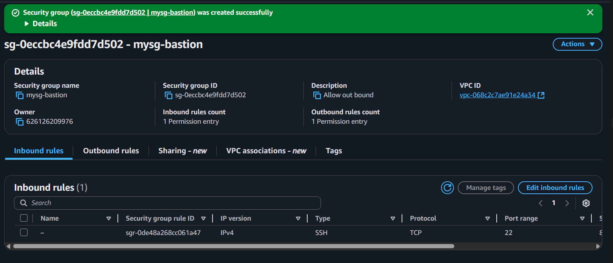

======================================================================
0) Підготовка
======================================================================
- Регіон: eu-central-1 (Frankfurt)  [ЗАМІНИ на свій, якщо інший]
- Імена ресурсів (приклад):
  VPC: my-vpc
  IGW: my-igw
  Subnets: public-subnet-a (10.0.1.0/24), private-subnet-a (10.0.2.0/24)
  Route tables: rt-public-a, rt-private-a
  NAT GW: nat-gw-a (з Elastic IP)
  SG: sg-bastion, sg-private
  EC2: bastion-public (Ubuntu 24.04, t2.micro), app-private (Ubuntu 24.04, t2.micro)
- Ключ SSH: ~/.ssh/svitlana-kizilpinar.pem (права 600)

======================================================================
1) Створення VPC
======================================================================
1.1 Відкрити AWS Console → VPC → Your VPCs → Create VPC.
1.2 Обрати "VPC only".
1.3 Заповнити:
    - Name: my-vpc
    - IPv4 CIDR: 10.0.0.0/16
    - Tenancy: default
    - Enable DNS hostnames: ON
    - Enable DNS resolution: ON
1.4 Create VPC.

Чому так:
- 10.0.0.0/16 дає простір для підмереж і уникає конфліктів з 192.168.x.x (домашні мережі).
- DNS потрібен для репозиторіїв/імен.

======================================================================
2) Internet Gateway (створити ПЕРШИМ)
======================================================================
2.1 VPC → Internet Gateways → Create internet gateway.
2.2 Name: my-igw → Create.

2.3 Actions → Attach to VPC → обрати my-vpc.

Навіщо:
- IGW надає вхід/вихід у публічній підмережі (для bastion).

======================================================================
3) Підмережі (Subnets)
======================================================================
3.1 VPC → Subnets → Create subnet.
    - VPC: my-vpc
    - Name: public-subnet-a
    - AZ: eu-central-1a
    - CIDR: 10.0.1.0/24
    → Create.

3.2 Повторити для приватної:
    - Name: private-subnet-a
    - AZ: eu-central-1a
    - CIDR: 10.0.2.0/24

3.3 Вмикаємо публічну IP-автовидачу для public-subnet-a:
    Subnets → public-subnet-a → Actions → Edit subnet settings →
    Enable auto-assign public IPv4 address: ON → Save.

Пояснення:
- Публічні EC2 мають отримувати public IP автоматично.
- Приватним — public IP не потрібен.

======================================================================
4) NAT Gateway (для інтернету з приватної підмережі)
======================================================================
4.1 VPC → NAT Gateways → Create NAT gateway.
    - Subnet: public-subnet-a
    - Connectivity type: Public
    - Elastic IP: Allocate new EIP → Associate
    - Name: nat-gw-a
    → Create (дочекатися статусу Available).

Чому:
- Приватна EC2 виходитиме у світ через NAT (односторонній доступ: тільки OUT).

======================================================================
5) Таблиці маршрутів (Route Tables)
======================================================================
5.1 Публічна таблиця (rt-public-a):
    - VPC → Route tables → Create route table:
      Name: rt-public-a, VPC: my-vpc → Create.

    - Відкрити rt-public-a → Routes → Edit routes → Add route:
      Destination: 0.0.0.0/0 → Target: Internet Gateway (my-igw) → Save.

    - Subnet associations → Edit → обрати public-subnet-a → Save.

5.2 Приватна таблиця (rt-private-a):
    - Create route table:
      Name: rt-private-a, VPC: my-vpc → Create.

    - Routes → Edit routes → Add route:
      Destination: 0.0.0.0/0 → Target: NAT Gateway (nat-gw-a) → Save.

    - Subnet associations → Edit → обрати private-subnet-a → Save.

Логіка:
- Паблік ходить в Інтернет через IGW, приватний — через NAT GW.

======================================================================
6) Security Groups
======================================================================
6.1 Одна спільна група безпеки (sg-bastion) для обох інстансів
======================================================================
- Використовується одна Security Group у межах VPC `my-vpc`, 
  яку застосовано і до bastion-public, і до app-private.
- Правила налаштовані так, щоб дозволяти доступ як з Інтернету, так і між інстансами всередині VPC.

Inbound rules:
  1. SSH (TCP, порт 22) — Source: <мій зовнішній IP>/32 (наприклад 88.72.141.255/32)
     → дозволяє підключення з мого локального комп’ютера до bastion-public через Інтернет.
  2. SSH (TCP, порт 22) — Source: sg-bastion (та сама security group)
     → дозволяє SSH-з’єднання між інстансами, які належать до цієї ж групи,
       тобто bastion-public може підключатися до app-private усередині VPC.

Outbound rules:
  - All traffic (за замовчуванням)
    → дозволяє вихідний трафік з обох інстансів на будь-які адреси.

Пояснення:
- Перше правило забезпечує зовнішній SSH доступ до публічного інстанса.
- Друге правило (self-reference) дозволяє внутрішню комунікацію між EC2,
  які мають цю саму групу безпеки — тобто bastion може входити на private.
- Це правильне і безпечне рішення, яке не ламається при зміні IP-адрес.
- Для навчального середовища достатньо однієї SG, 
  у production зазвичай роблять окремі SG для bastion і private.

Best practice:
- Використовуємо “SG → SG”, а не IP бастіона — не ламається при зміні адрес.

======================================================================
7) EC2 інстанси
======================================================================
7.1 bastion-public:
    - EC2 → Instances → Launch instance
      Name: bastion-public
      AMI: Ubuntu 24.04 LTS (або Amazon Linux 2)
      Type: t2.micro
      Key pair: свій .pem
      Network:
        VPC: my-vpc
        Subnet: public-subnet-a
        Auto-assign public IP: Enable
        Security group: sg-bastion
      Storage: 8 GB (default)
    → Launch.

7.2 app-private:
    - Launch instance
      Name: app-private
      AMI: Ubuntu 24.04 LTS
      Type: t2.micro
      Key pair: той самий .pem
      Network:
        VPC: my-vpc
        Subnet: private-subnet-a
        Auto-assign public IP: Disable
        Security group: sg-bastion
      Storage: 8 GB (default)
    → Launch.

======================================================================
8) Перевірка SSH доступності (Public)
======================================================================
8.1 З локального ПК:
    chmod 600 ~/.ssh/svitlana-kizilpinar.pem
    ssh -i ~/.ssh/svitlana-kizilpinar.pem ubuntu@<BASTION_PUBLIC_IP>

Очікування:
- Успішний логін на bastion-public (має public IP і маршрут через IGW).

======================================================================
9) ProxyJump (SSH у приватний через бастіон)
======================================================================
Варіант А — одноразова команда з локального ПК:
    ssh -i ~/.ssh/svitlana-kizilpinar.pem -A -J ubuntu@<BASTION_PUBLIC_IP> ubuntu@<PRIVATE_IP>

Очікування:
- Логін одразу на app-private через стрибок.

======================================================================
10) Перевірка: приватний НЕ доступний з Інтернету напряму
======================================================================
10.1 Спроба з локального ПК:
    ssh -i ~/.ssh/svitlana-kizilpinar.pem ubuntu@<PRIVATE_IP>
Очікування:
- Timeout/No route — це правильно (немає public IP і немає маршруту ззовні).

======================================================================
11) Перевірка: приватний МАЄ доступ в Інтернет (через NAT)
======================================================================
11.1 Вже перебуваючи на app-private, виконати:
    ping -c 3 google.com

Очікування:
- ping/NS запис розвʼязується.

======================================================================
12) Підсумок відповідності вимогам
======================================================================
- VPC створено: 10.0.0.0/16, DNS ON.
- Дві підмережі: public 10.0.1.0/24, private 10.0.2.0/24.
- IGW прикріплено, rt-public-a: 0.0.0.0/0 → IGW.
- NAT GW у public-subnet-a з EIP, rt-private-a: 0.0.0.0/0 → NAT GW.
- EC2: bastion-public з public IP (SSH з Інтернету OK).
- EC2: app-private без public IP (SSH лише через bastion/proxyjump).
- Інтернет на приватному через NAT: OK (curl/apt/ping).

**Завдання виконано успішно!** Всі скріншоти та результати тестування демонструють правильно налаштовану AWS VPC інфраструктуру.

======================================================================
13) (Опційно) Прибирання (щоб не платити за NAT GW)
======================================================================
- Зупинити/Terminate EC2.
- Видалити NAT Gateway (потім його EIP).
- Відвʼязати і видалити IGW.
- Видалити route tables (якщо створювались окремо).
- Видалити subnets.
- Видалити VPC.